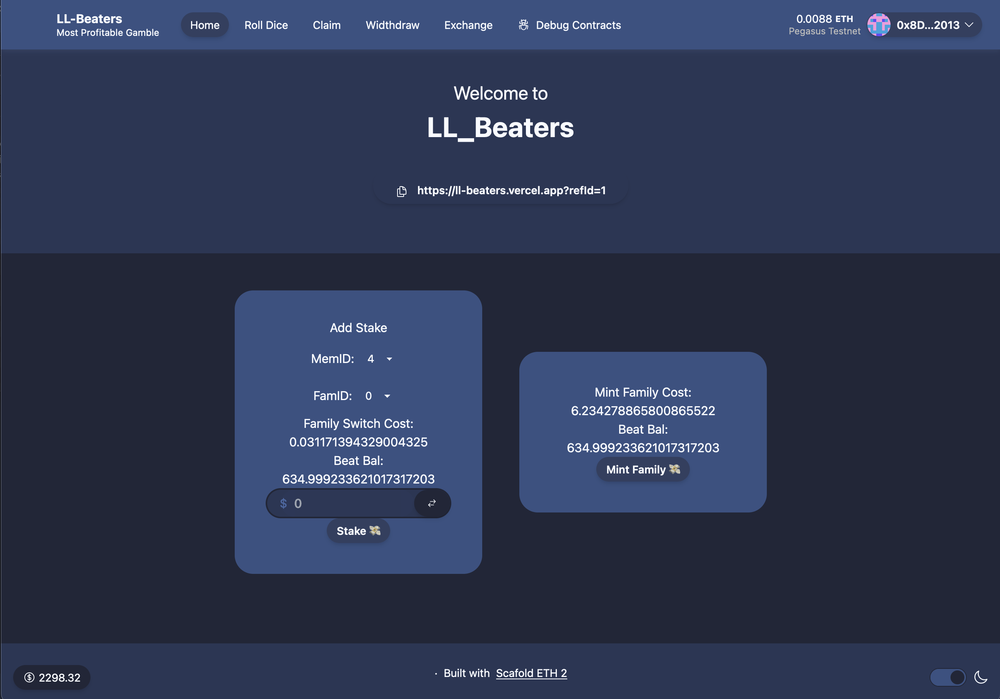
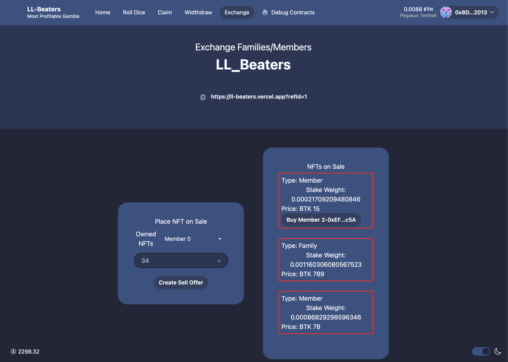

# LL-Beaters

LL-Beaters is a decentralized perpetual lottery platform that offers participants a chance to win rewards by staking ETH in lottery challenges. The platform operates on the [Lightlink Gasless Blockchain](https://www.lightlink.io/) and utilizes ERC20 and ERC721 standards for tokenization and non-fungible assets. Winnings are distributed to holders of Families and Members of such families, represented as ERC721 NFTs, with additional rewards for participants with referrals.

## User Story

User begins their journey on LL-Beaters by staking ETH and choosing a Family they want. A Member NFT is minted for them within the Family, and a unique referral ID is generated on-chain. They can share this referral ID to increase their earnings.

After each epoch elapses, any wallet address can roll the dice, and a subsection of the Families available will be selected randomly using [API3's QRNG](https://docs.api3.org/reference/qrng/). All the winning Families will receive an equal share of the [Beat Token](https://pegasus.lightlink.io/address/0xFDC16E5220A83F6e8BD2C5FB0923E1e418C33644) (LL-Beaters platform token). Then, owners and members of such families will receive their share following the [token economics](#token-economics) as described.

Holders of the [Family](https://pegasus.lightlink.io/address/0x4306D6012325BF7b0d24BC55994439DDa869D092) or [Member](https://pegasus.lightlink.io/address/0xEF63b90842AbBeD1A9B27A56A685EADcC4157c5A) NFTs can trade them for Beat Tokens in the [marketplace](https://ll-beaters.vercel.app/exchange) deployed using the [LiteFlow](https://liteflow.com/) infrastructure and tooling. The desirable trait of these NFTs is the history of activity recorded in them and the potential Beat Tokens they might hold. Referrers also receive part of the fees after successful exchange of the NFTs on the marketplace.

At any time in the future, users with Beat Tokens can withdraw ETH from the contract by burning the Beat Tokens and paying a small fee.

A Member NFT can switch to any Family they wish at the time of staking ETH.

## Demo Link

[https://ll-beaters.vercel.app/](https://ll-beaters.vercel.app/)


_Add Stake View_


_Marketplace View_

## Key Features

-   **Decentralized Perpetual Lottery**: LL-Beaters operates as a decentralized perpetual lottery platform within unique Family structures.

-   **Unique Referral IDs:** Participants receive unique referral IDs for additional earnings by sharing and referring others.

-   **Random Selection of Winning Families**: API3's QRNG is used to randomly select winning Families after each epoch.

-   **Distribution of Beat Tokens:** Winners receive a share of the Beat Token, distributed according to the platform's token economics and their activity on the platform.

-   **NFT Marketplace:** Family and Member NFTs can be traded for Beat Tokens in the marketplace deployed using LiteFlow, with NFT owners and referrers earning fees from successful exchanges.

## Token Economics

LL-Beaters operates on the Beat token, which serves as the native currency of the platform. The tokenomics of BTK include:

-   **Token Distribution:** BTK is emitted in epochs with each epoch spanning about 24hrs. The emission starts at 3,000 BTK from epoch 0 and reduces with each passing epoch with a half-life of 3,465 epochs.

    ```solidity
        function _getEpochMint(uint256 epoch) internal pure returns (uint256 mint) {
            mint = EPOCH_ZERO_MINT;
            uint256 halfLife = 3_465;

            mint >>= (epoch / halfLife);
            epoch %= halfLife;
            mint -= ((mint * epoch) / halfLife / 2);
        }
    ```

    1. 75% of an epoch's emission is shared among winning Families and their Members. 5% of this amount is reserved for referrers of the holders of such Families or Members. Where there's not referrer, the referrer value is burnt

    1. 20% of epoch's emission is reserved for liquidity mining, social mining, bounties and other ecosystem activities.

    1. 5% of epoch's emission is reserved for team and platform's infrastructure.

-   **Utility:** BTK tokens can be used for various purposes within the platform, including withdrawing ETH staked on the platform, purchasing Families and Members from the marketplace, and staking for liquidity mining.

-   **Value Proposition:** The value of BTK tokens is driven by demand from stakers and collectors seeking to participate in the lottery and marketplace, as well as by the overall growth and adoption of the platform.

## Future Development

In the future, I plan to enhance LL-Beaters with additional features such as:

-   Integration with other DeFi protocols for additional earning opportunities

-   Expansion of the referral program to further incentivize community growth

-   Enhanced user interface and experience for seamless participation in lottery challenges

## Media
-   [Pitch Deck](LL-Beaters-Pitch-Deck.key)
-   [Presentation](https://youtu.be/ZIDCNvCBcK0)
